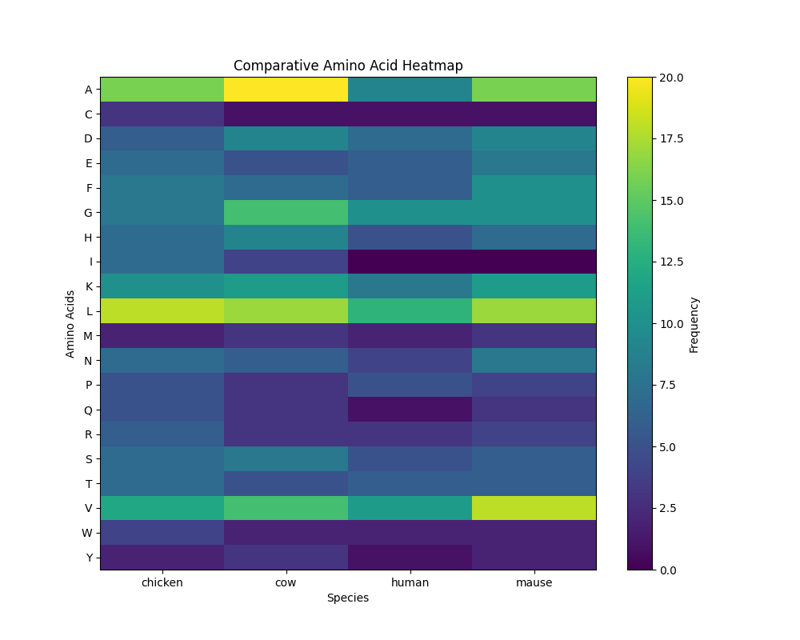

# Comparative Hemoglobin Analysis Across Species

## Overview

This project investigates hemoglobin protein sequences from multiple species using Python and Bioinformatics tools.

Species included:

- Human
- Mouse
- Cow
- Chicken

## Objectives

- FASTA sequence parsing
- Protein sequence analysis
- Amino acid composition analysis
- Molecular property calculation
- Sequence alignment
- Similarity matrix generation
- Heatmap visualization
- Phylogenetic tree construction

## Tools Used

- Python 3.11
- Biopython
- Pandas
- Matplotlib
- SciPy

## Project Structure

data/
src/
results/

## Author

Abdulrahman Saleh

Pharmacist & Bioinformatics Learner

## Results

### Mutation Bar Chart

### Mutation Distribution Pie Chart

### Mutation Heatmap

